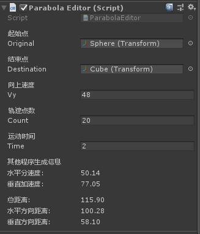
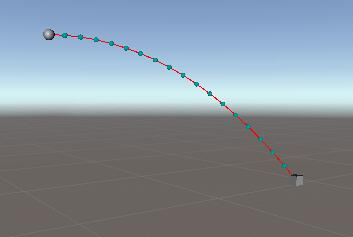
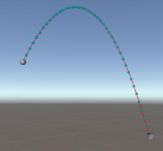

## 游戏中用来生成不同形状的抛物线

### 用法：

1. 菜单栏  Tools-> Parabola 打开场景， 运行，点击空格键按钮，可以看到按照抛物线运动的球体

2. 编辑器可以选择起始点、终点、 运动时间、 上抛速度

### 参数：

配置选项： 起始点、终点、 运动时间、 上抛速度， 这些参数决定了抛物线的形状

并根据配置选项生成垂直加速度、 水平速度等运动信息

## 效果

__平抛：__

__上抛：__

